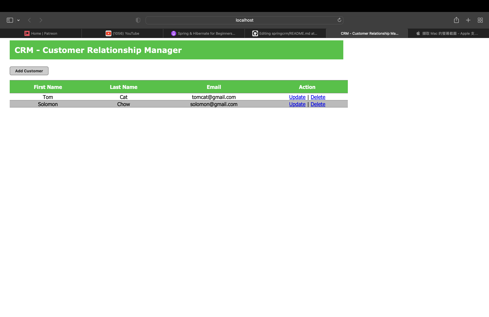

# Springcrm
This is my first Spring project which is the building of a CRM. 

### Introduction

This is the sample CRM that was created when I was doing the revision of Spring via a course 
in udemy. 

#### Technology used

Database and SQL Engine: MySQL Database

Java JDK Version: OPEN JDK 17

Hibernate Version: 5.6.5.Final

Spring Framework: 5.3.21

Javax Annotation: 1.3.2

Javax Servlet: 2.5

Junit Jupiter: 5.8.1

Mockito : 4.8.0

### Functionality

It can create, update, delete and read the customer from the database.

### User Interface

The appearance of the CRM application just like follow

